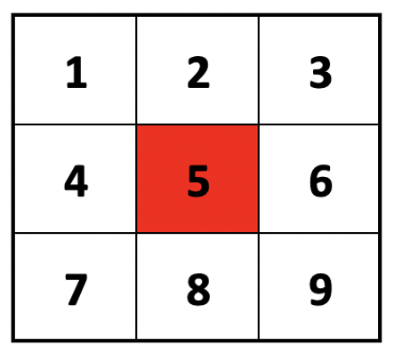
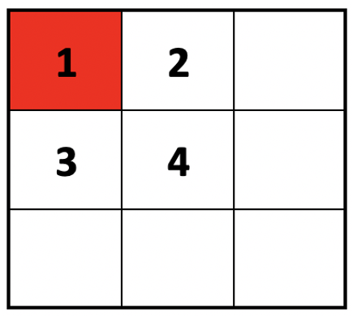
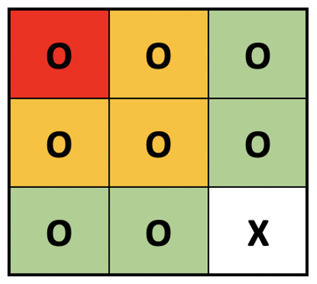

## Requirements
- [x] Ability to select the game parameters: number of rows, columns, and mines
- [x] When a cell with no adjacent mines is revealed, all adjacent squares will be revealed (and repeat)
- [x] Ability to 'flag' a cell with a question mark or red flag
- [ ] Detect when game is over
- [ ] Persistence
- [ ] Ability to start a new game and preserve/resume the old ones
- [ ] Design and implement a documented RESTful API for the game (think of a mobile app for your API)
- [ ] Implement an API client library for the API designed above. Ideally, in a different language, of your preference, to the one used for the API
- [ ] Time tracking
- [ ] Ability to support multiple users/accounts

## First part/commit
#### Solved points:
- Ability to select the game parameters: number of rows, columns, and mines
- When a cell with no adjacent mines is revealed, all adjacent squares will be revealed (and repeat)

At the beginning, I thought that the best approach would be doing a 2d array, having all cells in a “map”. Each cell would have had a state, either covered, uncovered or bomb. That way is easier to check and process each click, but then I figure out that if I create a board with 100 rows and 100 columns, I would have needed to save 10.000 objects into the database to save the state of the game.

My next option was to only save the position of each bomb, so when I receive a click, it would be easier to know if I hit one. But… I was missing the covered/uncovered cells.
So my final design was to only have in memory/database the position of each bomb plus all uncovered cells.

Taking this into account, having a board of 100x100 and only one bomb, without any uncovered cell, I would only need the width and the height of the board plus the position of the bomb instead of 10.000 objects. Of course, as we complete the game, the amount of objects created increases.

After all this, I already had my board and the bombs setted. I could already check if a position had a bomb or was empty, but I was missing the uncover part of the adjacent cells.
My idea was to, based on a cell, check the three upper cells, then both of its sides, and for last the three bottom cells.
e.g: after clicking in the red cell, the order of checking would be:\

Another example can be: clicking in red, only checks its adjacent cells in that order, because there wasn’t any above row or left column.\

The last thing that I had to solve was the recurrency. For each checked cell, I had to do the same for each of its adjacent cells.

An for last, a full example: having a bomb on X and clicking in red, would uncover all yellow cells and this ones will uncover the green ones. Of course, the X would still be covered.\

To round up this first part, the method that processes everything when a cell is clicked, it returns a response of that click. It contains the result of that click, that could be an empty cell, an already clicked one, or a hit bomb. Also, it returns all uncovered cells to display to the client. The bombs positions are never sended to the user for obvious reasons.
