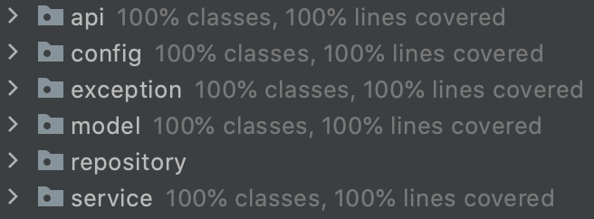

## Requirements
- [x] Ability to select the game parameters: number of rows, columns, and mines
- [x] When a cell with no adjacent mines is revealed, all adjacent squares will be revealed (and repeat)
- [x] Ability to 'flag' a cell with a question mark or red flag
- [x] Detect when game is over
- [x] Persistence
- [x] Ability to start a new game and preserve/resume the old ones
- [x] Design and implement a documented RESTful API for the game (think of a mobile app for your API)
- [x] Time tracking
- [x] Ability to support multiple users/accounts
- [ ] Implement an API client library for the API designed above. Ideally, in a different language, of your preference, 
to the one used for the API

## First part - Core logic
#### Solved points:
- Ability to select the game parameters: number of rows, columns, and mines
- When a cell with no adjacent mines is revealed, all adjacent squares will be revealed (and repeat)

At the beginning, I thought that the best approach would be doing a 2d array, having all cells in a “map”. Each cell 
would have had a state, either covered, uncovered or bomb. That way is easier to check and process each click, but then 
I figure out that if I created a board with 100 rows and 100 columns, I would have needed to save 10.000 objects into the 
database to save the state of the game.

My next option was to save only the position of each bomb, so when I receive a click, it would be easier to know if I 
hit one. But… I was missing the covered/uncovered cells.
So my final design was to have only in memory/database the position of each bomb plus all uncovered cells.

Taking this into account, having a board of 100x100 and only one bomb, without any uncovered cell, I would only need 
the width and the height of the board plus the position of the bomb instead of 10.000 objects. Of course, as we complete 
the game, the amount of objects created increases.

After all this, I already had my board and the bombs set. I could already check if a position had a bomb or if it was 
empty, but I was missing the uncover part of the adjacent cells.
My idea was to, based on a cell, check the three upper cells, then both of its sides, and at last the three bottom cells.
e.g: after clicking in the red cell, the order of checking would be:\

Another example can be: clicking in red only checks its adjacent cells in that order, because there wasn’t any above 
row or left column.\

The last thing that I had to solve was the recurrency. For each checked cell, I had to do the same for each of its 
adjacent cells.

An for last, a full example: having a bomb on X and clicking in red, would uncover all yellow cells and this ones will 
uncover the green ones. Of course, the X would still be covered.\

To round up this first part, the method that processes everything when a cell is clicked, it returns a response of that 
click. It contains the result of that click, that could be an empty cell, an already clicked one, or a hit bomb. Also, 
it returns all uncovered cells to display to the client. The bombs positions are never sent to the user for obvious 
reasons.

## Second part - Flags
#### Solved points:
- Ability to 'flag' a cell with a question mark or red flag

To be able to mark cells as flagged, I took the same approach as for uncovered cells. I added a new set collection to
save all flagged positions. I also had to add the validation that it isn't flagged on click and not being able to mark
one which was already uncovered.

## Third part - Game won
#### Solved points:
- Detect when game is over

I could check if you hit a bomb, but I couldn't tell if you won the game. To do this, after each click, I check 
if the amount of uncovered cells are equal to the total of cells minus the amount of bombs. In other words, if there 
wasn't any empty cell to click on. uncoveredCells == (totalCells - amountOfBombs)
I added a new Click result (the response of what happened with that click that you did) of WIN.

### Refactor

I realized that I had a lot of logic in the board object, so I needed to start cleaning that class. I wrapped the uncovered
and flagged collections into a new class called "Cells". There, I could check if a cell was uncovered or flagged and 
also mark them.
I did something similar for the bomb collection creating the Bombs class. There I put the algorithm to set the bombs and
check if a bomb was hit.
I also improved the use of the object Coordinates, to make the checks more clear using "equals".

## Fourth part - Persistence and API
#### Solved points:
- Persistence
- Ability to start a new game and preserve/resume the old ones
- Design and implement a documented RESTful API for the game (think of a mobile app for your API)

I created a mongodb on Atlas (cloud.mongodb.com). In there I will persist all games with:
- Its ID
- The position of each bomb
- All uncovered cells
- All flagged cells
- The size of the board (height and width)
- The game status (WON, PLAYING, LOST)

What I do is each time that a command is sent by the user, it is required to send the game to apply that command. I get
that game from the db, perform the command and save it again into the database.
I implemented the API endpoints to simulate a game. This API controller will call the game service. Using a repository, 
it will create a game, load a game, or perform any action (uncover or flag cells).
The API has this endpoints:\
- POST to /minesweeper: will create a game with the received parameters (board height, width and amount of bombs).
- GET to /minesweeper/{gameId}: it will return a previously created game.
- POST to /minesweeper/{gameId}/click: it will uncover a position. It will return how it went. If the cell was empty, 
already uncovered, it was a bomb or if it was flagged.
- POST to /minesweeper/{gameId}/flag: same as /click, but to flag a position. If that position was already uncovered,
it will not do anything. If it was already flagged, it will unflag that position.

To document the API I used swagger. To access, you can click [here](https://pm-minesweeper.herokuapp.com/swagger-ui/)

## Fifth part - Time tracking and Users/Accounts
#### Solved points:
- Time tracking
- Ability to support multiple users/accounts

##### Time tracking:
My first idea to add time tracking was to add a `ZonedDateTime` to the game. I used one for when the game started and 
another one to know when it finished. So when I respond to the client I will send those two properties to calculate the
elapsed time between when it started and the current time or the finished time.
With this I had a problem saving it into mongo. Mongo doesn't support `ZonedDateTime`, so what I did to solve this issue
was to convert that object into an instant and then persist it. To have consistency with this, every conversion is done 
using the UTC offset. After this, I create a get method for those instants which convert them back to `ZonedDateTime`,
also using UTC.
When the game is won or lost, I will set the finished time.

##### Users/Accounts:
What I did here, to keep it simple, was to create a new controller, a new service and a new repository.
An empoint will create a new user, only with its name, and save it into the database. This will generate an Id, which
it will be used in each API call of `/minesweeper` as a head parameter to know who is doing that action and validating
that, for example, the user doing the action is the game owner. If it isn't, it will not find any game to perform that 
action.
Also, there's another endpoint to get an existing user with its ID
User API endpoints:
- POST to /user: will create a new user.
- GET to /user/{userId}: will try to get an existing user.

## Sixth part - Integration tests
To finish with this proyect, I decided to reach a 100% coverage. To do that, I had to use Integration tests with rest 
assure and embebed mongo.\
 
